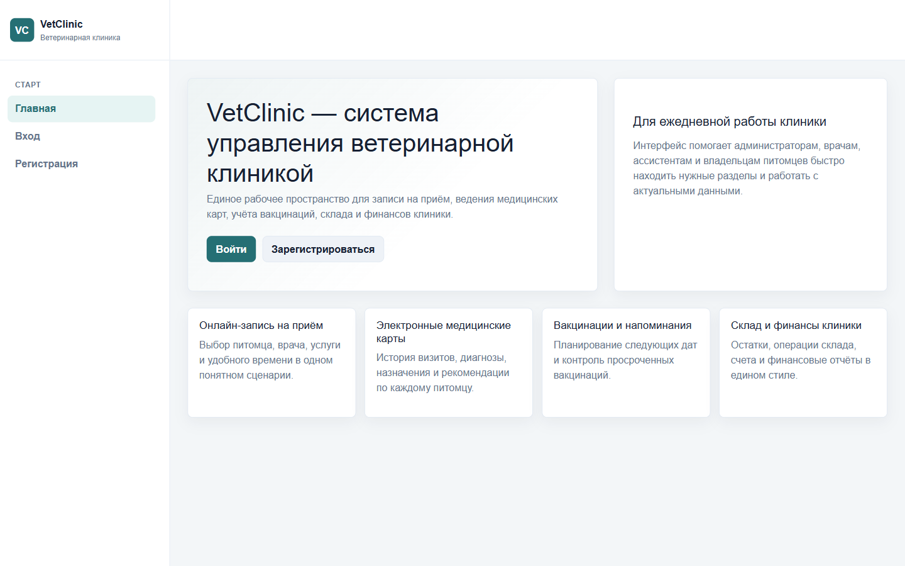
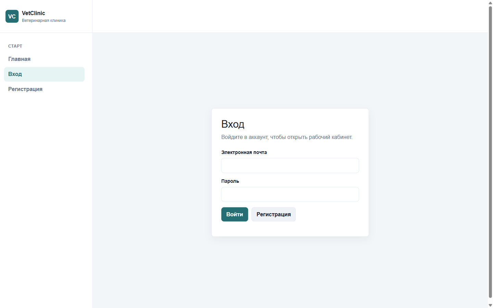
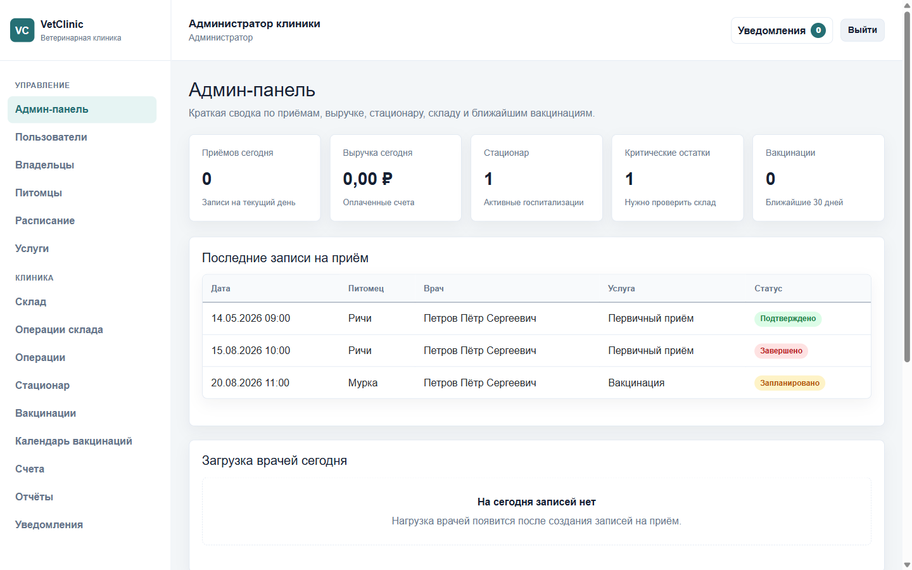
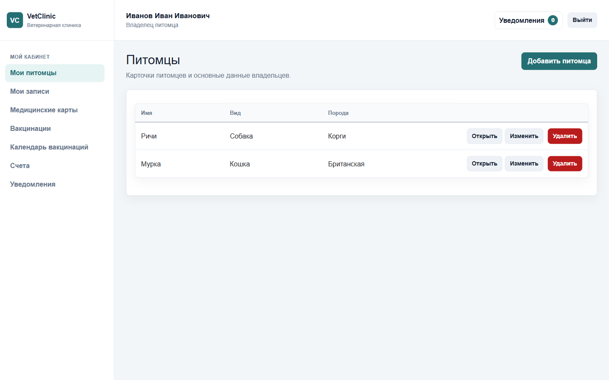
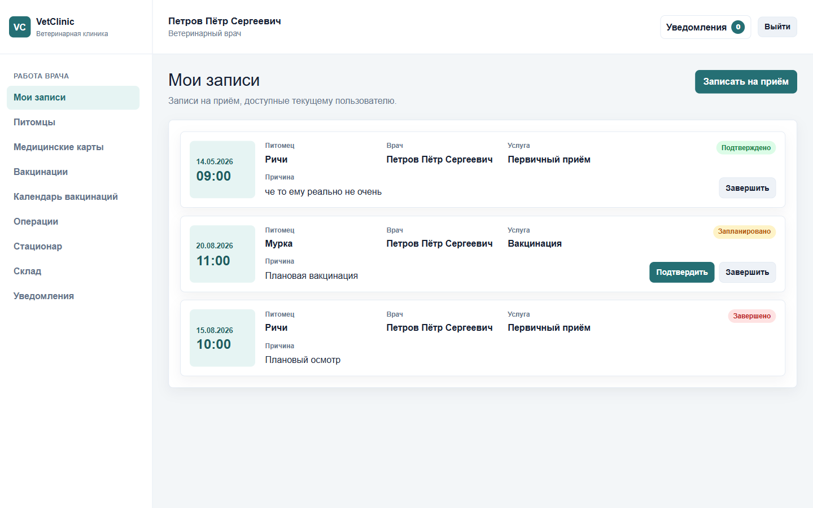

# VetClinic

**VetClinic** — учебное fullstack веб-приложение для управления ветеринарной клиникой.

Проект демонстрирует backend-разработку на **ASP.NET Core Web API** с использованием
**PostgreSQL**, **Entity Framework Core**, **ASP.NET Core Identity**,
**JWT-аутентификации**, ролевой модели доступа и **SignalR** для уведомлений.

Клиентская часть реализована на **Blazor WebAssembly**. Общие DTO и enum-типы
вынесены в отдельную shared-библиотеку.

## Статус проекта

Проект находится в учебном статусе и предназначен для портфолио начинающего
.NET/backend-разработчика.

В репозитории есть рабочая структура backend, frontend и shared-моделей,
миграции EF Core, seed-инициализация для тестовых пользователей и скриншоты
интерфейса.

CI/CD, Docker-конфигурация и автотесты в проекте сейчас не настроены.

## Скриншоты

Скриншоты находятся в папке `documentation/screenshots`.

### Главная страница



### Авторизация



### Панель администратора



### Кабинет владельца питомца



### Рабочее пространство ветеринара



## Основной функционал по ролям

### Администратор

- Просмотр административной панели со сводкой по приемам, выручке, стационару,
  складу и вакцинациям.
- Управление пользователями, владельцами, сотрудниками и ролями.
- Управление питомцами, расписанием приемов и услугами клиники.
- Работа со складом, складскими операциями, операциями, стационаром,
  вакцинациями и счетами.
- Просмотр отчетов по выручке, загрузке врачей, популярным услугам,
  использованию склада и приемам.

### Ветеринарный врач

- Просмотр своих приемов и приемов на сегодня.
- Работа с медицинскими картами питомцев.
- Создание и ведение записей о вакцинациях.
- Создание и обновление данных об операциях.
- Просмотр стационара, склада и уведомлений.

### Владелец питомца

- Регистрация и вход в личный кабинет.
- Добавление и редактирование своих питомцев.
- Создание записи на прием.
- Просмотр своих приемов, медицинских записей, вакцинаций и счетов.
- Получение уведомлений.

### Ассистент

- Просмотр расписания приемов.
- Работа со складом и складскими транзакциями.
- Просмотр и ведение данных по стационару.
- Создание записей ухода за госпитализированными питомцами.
- Получение уведомлений по рабочим событиям.

## Технологический стек

**Backend**

- C# 12, .NET 8
- ASP.NET Core Web API
- Entity Framework Core
- PostgreSQL
- ASP.NET Core Identity
- JWT Bearer Authentication
- Role-based authorization
- SignalR
- Swagger / OpenAPI

**Frontend**

- Blazor WebAssembly
- Razor Components
- HttpClient для REST API
- SignalR Client
- Role-based навигация
- Bootstrap и собственные CSS-стили

**Shared**

- DTO для запросов и ответов
- Enum-типы для статусов, ролей и категорий

## Архитектура проекта

Решение разделено на три основных проекта:

- `VetClinic.Api` — backend на ASP.NET Core Web API. Здесь находятся
  контроллеры, EF Core DbContext, модели БД, сервисы бизнес-логики, миграции,
  Identity, JWT и SignalR Hub.
- `VetClinic.Client` — frontend на Blazor WebAssembly. Клиент обращается к API
  через typed-сервисы и хранит данные авторизации в localStorage.
- `VetClinic.Shared` — общая библиотека с DTO, request/response-моделями и
  enum-типами, которые используются и API, и клиентом.

Основной поток работы:

1. Пользователь проходит регистрацию или авторизацию через `api/Auth`.
2. API выдает JWT-токен с ролью пользователя.
3. Blazor-клиент сохраняет токен и добавляет его к запросам.
4. Backend проверяет доступ через `[Authorize]` и роли `Admin`,
   `Veterinarian`, `Owner`, `Assistant`.
5. Уведомления доставляются через REST API и SignalR Hub
   `/hubs/notifications`.

## Структура проекта

```text
VetClinic/
├── VetClinic.Api/
│   ├── Controllers/          # REST API controllers
│   ├── Data/                 # AppDbContext и seed-инициализация
│   ├── Hubs/                 # SignalR Hub для уведомлений
│   ├── Interfaces/           # Интерфейсы сервисов
│   ├── Migrations/           # EF Core migrations
│   ├── Models/               # Entity-модели
│   ├── Services/             # Бизнес-логика
│   ├── Program.cs            # Конфигурация API
│   └── appsettings.json      # Пример локальной конфигурации
├── VetClinic.Client/
│   ├── Components/           # UI-компоненты
│   ├── Layout/               # Layout и навигация
│   ├── Pages/                # Страницы Blazor
│   ├── Services/             # API-клиенты и auth/localStorage-сервисы
│   └── wwwroot/              # Статика клиента
├── VetClinic.Shared/
│   ├── Enums/                # Роли, статусы и категории
│   ├── Requests/             # DTO запросов
│   └── Responses/            # DTO ответов
├── documentation/
│   ├── screenshots/          # Скриншоты интерфейса
│   ├── ТЗ.pdf
│   └── УчебкаОтчетСмирнов.pdf
├── .gitignore
├── README.md
└── VetClinic.slnx
```

## Установка и запуск

### Требования

- .NET SDK 8
- PostgreSQL
- dotnet-ef CLI tool

Установка `dotnet-ef`, если он еще не установлен:

```bash
dotnet tool install --global dotnet-ef
```

### 1. Клонировать репозиторий

```bash
git clone https://github.com/elon1te9/vet-clinic.git
cd vet-clinic
```

### 2. Настроить подключение к PostgreSQL

В файле `VetClinic.Api/appsettings.json` укажите локальную строку подключения
и JWT-настройки.

Не храните реальные пароли и приватные ключи в публичном репозитории.

```json
{
  "ConnectionStrings": {
    "DefaultConnection": "Host=localhost;Port=5432;Database=vetclinicdb_db;Username=postgres;Password=yourpassword"
  },
  "Jwt": {
    "Issuer": "VetClinic.Api",
    "Audience": "VetClinic.Client",
    "Key": "your-development-jwt-secret-key",
    "ExpiresMinutes": 120
  }
}
```

### 3. Применить миграции

```bash
cd VetClinic.Api
dotnet ef database update
```

### 4. Запустить API

```bash
dotnet run --launch-profile https
```

API будет доступен по адресу:

- `https://localhost:7096`
- Swagger UI: `https://localhost:7096/swagger`

### 5. Запустить Blazor WebAssembly клиент

В отдельном терминале:

```bash
cd VetClinic.Client
dotnet run --launch-profile https
```

Клиент будет доступен по адресу:

- `https://localhost:7131`

В `VetClinic.Client/Program.cs` базовый адрес API сейчас задан как
`https://localhost:7096`.

## Тестовые пользователи

Тестовые пользователи создаются через seed-инициализацию в
`VetClinic.Api/Data/DbInitializer.cs` при запуске API.

Пароль seed-пользователей намеренно не дублируется в README. Для локального
запуска его можно посмотреть или изменить в seed-коде проекта.

| Роль | Email |
| --- | --- |
| Admin | `admin@vetclinic.local` |
| Veterinarian | `doctor@vetclinic.local` |
| Owner | `owner@vetclinic.local` |
| Assistant | `assistant@vetclinic.local` |

## REST API

Документация API доступна через Swagger UI в Development-режиме:

```bash
https://localhost:7096/swagger
```

Маршруты ниже сверены с атрибутами `Route` и `Http*` в контроллерах проекта.

### AuthController

- `POST /api/Auth/register-owner`
- `POST /api/Auth/register-staff`
- `POST /api/Auth/login`
- `GET /api/Auth/me`

### UsersController

- `GET /api/users`
- `GET /api/users/{id}`
- `PUT /api/users/{id}/block`
- `PUT /api/users/{id}/role`
- `GET /api/owners`
- `GET /api/owners/my`
- `GET /api/owners/{id}`
- `GET /api/staff`
- `GET /api/staff/doctors`
- `GET /api/staff/assistants`
- `GET /api/staff/{id}`

### PetsController

- `GET /api/Pets`
- `GET /api/Pets/my`
- `GET /api/Pets/{id}`
- `POST /api/Pets`
- `PUT /api/Pets/{id}`
- `DELETE /api/Pets/{id}`

### AppointmentsController

- `GET /api/appointments`
- `GET /api/appointments/my`
- `GET /api/appointments/today`
- `GET /api/appointments/doctor/{doctorId}`
- `GET /api/appointments/{id}`
- `POST /api/appointments`
- `PUT /api/appointments/{id}/status`
- `DELETE /api/appointments/{id}`

### MedicalRecordsController

- `GET /api/medical-records`
- `GET /api/medical-records/{id}`
- `GET /api/medical-records/pet/{petId}`
- `POST /api/medical-records`
- `PUT /api/medical-records/{id}`

### VaccinationsController

- `GET /api/vaccinations`
- `GET /api/vaccinations/my`
- `GET /api/vaccinations/pet/{petId}`
- `GET /api/vaccinations/{id}`
- `GET /api/vaccinations/upcoming`
- `GET /api/vaccinations/overdue`
- `POST /api/vaccinations`
- `PUT /api/vaccinations/{id}`

### ServicesController

- `GET /api/services`
- `POST /api/services`
- `PUT /api/services/{id}`
- `DELETE /api/services/{id}`

### InventoryController

- `GET /api/inventory`
- `GET /api/inventory/low-stock`
- `GET /api/inventory/expiring`
- `GET /api/inventory/{id}`
- `POST /api/inventory`
- `PUT /api/inventory/{id}`
- `DELETE /api/inventory/{id}`

### InventoryTransactionsController

- `GET /api/inventory-transactions`
- `GET /api/inventory-transactions/item/{itemId}`
- `POST /api/inventory-transactions`

### SurgeriesController

- `GET /api/surgeries`
- `GET /api/surgeries/{id}`
- `GET /api/surgeries/pet/{petId}`
- `POST /api/surgeries`
- `PUT /api/surgeries/{id}`
- `PUT /api/surgeries/{id}/status`

### HospitalizationsController

- `GET /api/hospitalizations`
- `GET /api/hospitalizations/active`
- `GET /api/hospitalizations/{id}`
- `GET /api/hospitalizations/pet/{petId}`
- `POST /api/hospitalizations`
- `PUT /api/hospitalizations/{id}`
- `PUT /api/hospitalizations/{id}/close`

### CareLogsController

- `GET /api/care-logs/hospitalization/{hospitalizationId}`
- `POST /api/care-logs`

### FinanceController

- `GET /api/invoices`
- `GET /api/invoices/my`
- `GET /api/invoices/{id}`
- `POST /api/invoices`
- `PUT /api/invoices/{id}/pay`

### ReportsController

- `GET /api/reports/revenue`
- `GET /api/reports/doctor-load`
- `GET /api/reports/popular-services`
- `GET /api/reports/inventory-usage`
- `GET /api/reports/appointments-summary`

### NotificationsController

- `GET /api/notifications/my`
- `PUT /api/notifications/{id}/read`
- `PUT /api/notifications/read-all`

### AdminDashboardController

- `GET /api/admin/dashboard`
- `GET /api/admin/dashboard/today`

### NotificationHub

- `/hubs/notifications`

## Особенности реализации

- Ролевая модель доступа построена на ASP.NET Core Identity и
  `[Authorize(Roles = "...")]`.
- JWT используется для авторизации REST-запросов и подключения к SignalR Hub.
- EF Core migrations описывают структуру PostgreSQL-базы.
- Seed-инициализация создает роли, тестовых пользователей, базовые услуги
  клиники и складские позиции.
- DTO вынесены в `VetClinic.Shared`, чтобы API и Blazor-клиент использовали
  общий контракт данных.
- Blazor WebAssembly клиент разделен на страницы, переиспользуемые
  UI-компоненты и сервисы для обращения к API.
- Навигация клиента меняется в зависимости от роли пользователя.
- Для уведомлений используется отдельный `NotificationHub` и клиентский
  `SignalRNotificationService`.

## Что я изучил в процессе

- Проектирование REST API на ASP.NET Core.
- Настройку Entity Framework Core с PostgreSQL и миграциями.
- Работу с ASP.NET Core Identity, ролями и JWT-аутентификацией.
- Разделение fullstack-решения на API, клиент и shared-библиотеку.
- Организацию DTO-контрактов между backend и frontend.
- Реализацию SignalR-уведомлений.
- Построение интерфейса на Blazor WebAssembly с учетом разных ролей
  пользователей.

## Возможные улучшения

- Добавить автотесты для сервисов и API-контроллеров.
- Вынести локальные секреты в User Secrets или переменные окружения.
- Добавить Docker Compose для API, клиента и PostgreSQL.
- Настроить CI для сборки и проверки проекта.
- Добавить пагинацию, фильтрацию и сортировку для больших списков.
- Улучшить обработку ошибок и валидацию форм на клиенте.
- Добавить refresh tokens и более гибкое управление сессиями.
- Расширить документацию API примерами запросов и ответов.

## Документация

В папке `documentation` находятся учебные материалы проекта:

- `ТЗ.pdf` — техническое задание.
- `УчебкаОтчетСмирнов.pdf` — отчет по учебной практике.
- `documentation/screenshots` — скриншоты интерфейса.
